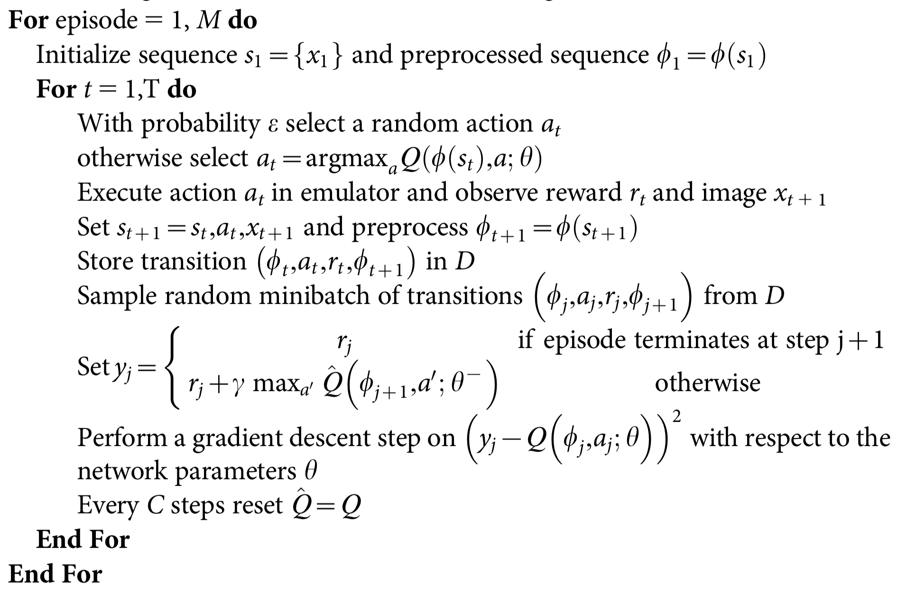
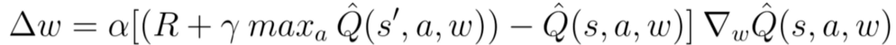
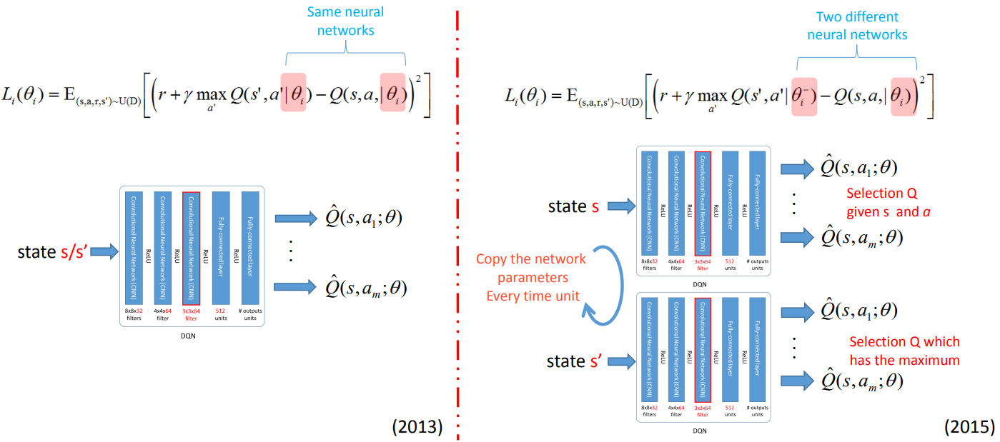
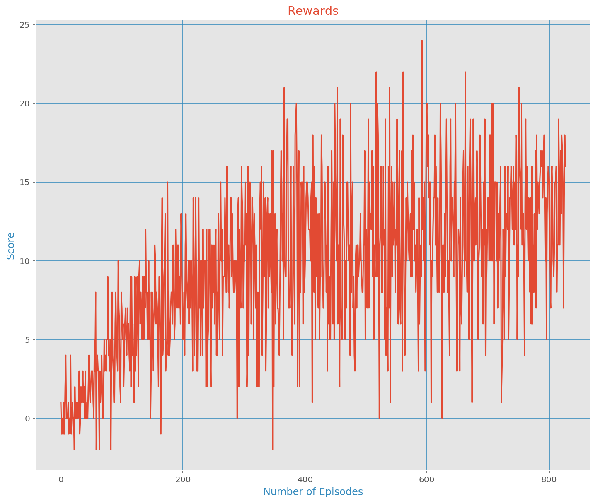

# Deep Q-Learning Network (DQN) Agent Navigation Project

### Introduction

In this project, **the goal is to train an agent to navigate a virtual world and collect as many yellow bananas as possible while avoiding blue bananas**

[image1]: https://user-images.githubusercontent.com/10624937/42135619-d90f2f28-7d12-11e8-8823-82b970a54d7e.gif "Trained Agent"


For this project, you will train an agent to navigate (and collect bananas!) in a large, square world.

![Trained Agent][image1]

A reward of +1 is provided for collecting a yellow banana, and a reward of -1 is provided for collecting a blue banana.  Thus, the goal of your agent is to collect as many yellow bananas as possible while avoiding blue bananas.

The state space has 37 dimensions and contains the agent's velocity, along with ray-based perception of objects around agent's forward direction.  Given this information, the agent has to learn how to best select actions.  Four discrete actions are available, corresponding to:
- **`0`** - move forward.
- **`1`** - move backward.
- **`2`** - turn left.
- **`3`** - turn right.

The task is episodic, and in order to solve the environment, your agent must get an average score of +13 over 100 consecutive episodes.


## Environment Details

This project was completed using the Udacity Workspace with GPU processing. [Unity ML-agents](https://github.com/Unity-Technologies/ml-agents) is used at the baseline for creating the environment.

A reward of +1 is provided for collecting a yellow banana, and a reward of -1 is provided for collecting a blue banana. Thus, the goal of the agent is to collect as many yellow bananas as possible while avoiding blue bananas.

The state space has 37 dimensions and contains the agent's velocity, along with ray-based perception of objects around the agent's forward direction.

Given this information, the agent has to learn how to best select actions. Four discrete actions are available, corresponding to:

- 0 - move forward.
- 1 - move backward.
- 2 - turn left.
- 3 - turn right.

The task is episodic, and **in order to solve the environment, the agent must get an average score of +13 over 100 consecutive episodes.**


## Agent Implementation

### Deep Q-Network

Deep Q-Learning Networks (DQN) combine Deep Neural Network aspects with Reinforcement learning. [Deep Q-Networks](https://deepmind.com/research/dqn/). Q-Learning is implemented in both the Deep Learning and Reinforcement Learning aspects in which the network (agent) attempts to find the optimal policy. This implementation takes the based DQN and adds two additional flavors, namely *Experience Replay* and *Fixed-Q Targets*. This implementation assumes the reader already has some familiarity with DQNs.

## Model
### Input Representation

1. Each image frame in RGB is converted into it's [luminosity's representation](https://stackoverflow.com/questions/596216/formula-to-determine-brightness-of-rgb-color), which has one channel instead of three.
2. Resulting images are rezised into a square image with size 84 x 84.
3. The tensor containing a sequence of the last 4 processed frames is used as input for the Deep Convolutional Neural Network. Such tensor has size (4 x 84 x 84).

### Neural Network
1. The neural network contains a sequence of **three convolutional layers**, each followed by a [Rectifier Linear Unit (ReLU)](https://en.wikipedia.org/wiki/Rectifier_(neural_networks)) layer.
2. The **output** of the last hidden layer is **flattened into a 1-dimensional** vector, which is used as the first layer of a fully-connected neural network.
3. The **first layer** of the fully-connected network is connected to a single hidden layer, with an additional ReLU.
4. The **output layer** has multiple outputs, each one for each possible action that the agent has.

This approach has several advantages over standard online Q-learning. First, each step of experience is potentially used in many weight updates, which allows for greater data efficiency. Second, learning directly from consecutive samples is inefficient, owing to the strong correlations between the samples; randomizing the samples breaks these correla- tions and therefore reduces the variance of the updates. Third, when learning on- policy the current parameters determine the next data sample that the parameters are trained on.

It is important to clarify that the neural network is not trained on the sequentially obtained inputs generated by playing the game, but rather on randomly sampled transitions/experiences from a data structure named **Replay Memory**, which improves learning performance by: not allowing the network to learn from correlations, and also permitting efficient data usage with the reuse of previous experiences.


### Deep Q-Learning with Experience Replay

Pseudocode for the Q-Learning algorithm which uses the previously mentioned model is presented next.

Following conventions are important to understand the pseudo-code:

- __M__: Number of episodes to train the learning agent.
- __sᵢ__: Environment/game frame at step i.
- __T__: Maximum number of steps (time limit) that the agent has in the current episode.
- __𝑄()__: Neural network that learns to approximate the real 'Q value' for every transition.
- __^𝑄()__: Copy of the previous neural network, which is used to calculate as the 'target values'. It is used to calculate the prediction error, and backpropagate the network. Every *C* steps it is updated as a copy of the network 𝑄.
- __φ__: Mapping function that takes a sequence of images and transforms it into an input representation (see *input representation* above).
- __D__: Replay memory. Contains transitions (φᵢ₊₁ ,a,r,φᵢ₊₂) that are randomly sampled to train the network.

**Pseudo-code:**



### Fixed-Q Targets

As we saw, the first component of the TD Error (TD stands for Temporal Difference) is the Q-Target and it is calculated as the immediate reward plus the discounted max Q-value for the next state. When we train our agent, we update the weights accordingly to the TD Error.




We move the output closer to the target, but we also move the target. So, we end up chasing the target and we get a highly oscillated training process. Wouldn’t be great to keep the target fixed as we train the network. Well, DeepMind did exactly that. Instead of using one Neural Network, it uses two. One as the main Deep Q Network and a second one (called Target Network) to update exclusively and periodically the weights of the target. This technique is called Fixed Q-Targets. In fact, the weights are fixed for the largest part of the training and they updated only once in a while. The image below demonstrates the general architecture.




### Code Implementation


**NOTE:** Code will run in GPU if CUDA is available, otherwise it will run in CPU :)

Code is structured in different modules. The most relevant features will be explained next:

1. **model.py:** It contains the main execution thread of the program. This file is where the main algorithm is coded (see *algorithm* above). PyTorch is utilized for training the agent in the environment. The agent has two hidden FC layers with a size of 1024. The input and output layer sizes vary based on values passed through the constructor.
2. **dqn_agent.py:** The model script contains a constructor that is responsible for initializing the *replay_buffer*, and both the *local* and *target networks*. Next, a *step()* function stores the *S,A,R,S',√* values in the *replay_buffer*. An *UPDATE_FREQ* flag allows for the *target weights* to be updated with the *current weights*. An *act()* function then takes the current policy (e.g. Epsilon-Greedy) and returns the actions for the state. Following this, a *learn()* function compares the hyperparameters based on the given *experiences*. Embedded in the *learn()* function, a *soft_update* feature based on the Fixed-Q algorithm takes the *local* weights and updates the *target* values.
3. **Navigation.ipynb:** The Navigation Jupyter Notebook provides an environment to run the *Banana* game, import dependencies, take *random_actions*, train the DQN, and plot the results. The hyperparameters can be adjusted within the Notebook.


### DQN Hyperparameters

The DQN agent uses the following parameters values (defined in dqn_agent.py)

```
BUFFER_SIZE = int(1e5)  # replay buffer size
BATCH_SIZE = 64         # minibatch size ## 64
GAMMA = 0.998           # discount factor ## 0.99
TAU = 1e-3              # target parameters soft update
LR = 5e-4               # learning rate (Initially 5e-4)
UPDATE_FREQ = 4         # update frequency
```

The Neural Networks use the following architecture :

```
-> Input Nodes (37)
-> FC Layer (1024 nodes, RELU)
-> FC Layer (1024 nodes, RELU)
-> Ouput Nodes (4)
```


### Results

With the afformentioned setup, the agent was able to successfully meet the functional specifications in 728 episodes an a total training time of 18.7min (see below):
```
Episode 100	Average Score: 2.14
Episode 200	Average Score: 6.76
Episode 300	Average Score: 8.88
Episode 400	Average Score: 10.34
Episode 500	Average Score: 10.60
Episode 600	Average Score: 11.44
Episode 700	Average Score: 11.86
Episode 800	Average Score: 12.71
Episode 828	Average Score: 13.10
Environment solved in 728 episodes!	Average Score: 13.10

Total Training time = 18.7 min
```

The target episodes was 1800, meaning this implementation is **2.472x more performant** than required.



From the image above, we can see that the agent is quite confused even though the state space is relatively small for the next immediate action. Therefore, additional models should be explored and are suggested in the Future Work section below.

### Future Work

This section contains two additional algorithms that would vastly improve over the current implementation, namely A3C and DDPG. Such algorithms have been developed by DeepMind and implemented in DRL-agents including robots from Boston Dynamics.

- [Asynchronous Advantage Actor-Critic (A3C)](https://arxiv.org/pdf/1602.01783.pdf):
A3C consists of multiple independent agents(networks) with their own weights, who interact with a different copy of the environment in parallel. Thus, they can explore a bigger part of the state-action space in much less time. The agents (or workers) are trained in parallel and update periodically a global network, which holds shared parameters. The updates are asynchronous (e.g. not simultaneous) and are used reset agent parameters to match the global network and continue their independent exploration and training for n-steps until they update themselves again.


- [Deep Deterministic Policy Gradient (DDPG)](https://spinningup.openai.com/en/latest/algorithms/ddpg.html)

> Deep Deterministic Policy Gradient (DDPG) is an algorithm which concurrently learns a Q-function and a policy. It uses off-policy data and the Bellman equation to learn the Q-function, and uses the Q-function to learn the policy.This approach is closely connected to Q-learning, and is motivated the same way: if you know the optimal action-value function Q^\*(s,a), then in any given state, the optimal action a^\*(s) can be found. DDPG interleaves learning an approximator to Q^\*(s,a) with learning an approximator to a^\*(s), and it does so in a way which is specifically adapted for environments with continuous action spaces. When there are a finite number of discrete actions, the max poses no problem, because we can just compute the Q-values for each action separately and directly compare them. Because the action space is continuous, the function Q^*(s,a) is presumed to be differentiable with respect to the action argument. This allows us to set up an efficient, gradient-based learning rule for a policy \mu(s) which exploits that fact. Then, instead of running an expensive optimization subroutine each time we wish to compute \max_a Q(s,a), we can approximate it with \max_a Q(s,a) \approx Q(s,\mu(s)).


## Additional References
_[1] Mnih, V. et al. Human-level control through deep reinforcement learning. Nature 518, 529–533 (2015)._

_[2] Mnih, V., Kavukcuoglu, K., Silver, D., Graves, A., Antonoglou, I., Wierstra, D., and Riedmiller, M. (Dec 2013). Playing Atari with deep reinforcement learning. Technical Report arXiv:1312.5602 [cs.LG], Deepmind Technologies._
